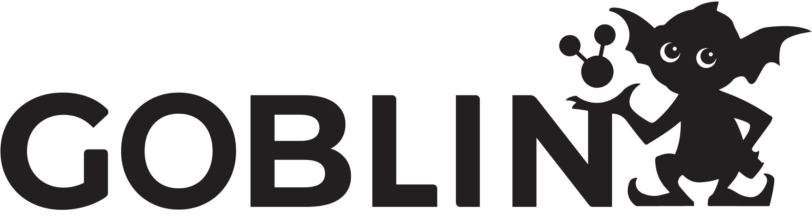
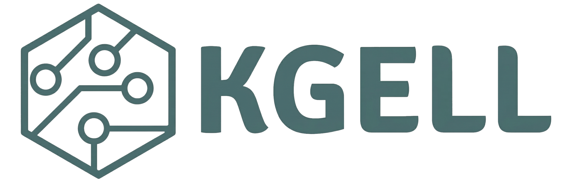

# Grants and Scholarships
If you are a student or an early career researcher attending SEMANTiCS 2026, you may be eligible to apply for any of the below **Grants and Scholarships** to support the costs of travel and lodging. In this page, we present a variety of opportunities available as internal funding or external funding.

**This is a live page as new information and scholarship opportunities are added as they become available. We encourage you to check back regularly if you are in need of a scholarship.**

### Disclaimer

Please note that these are forms of financial support, not an award or prize. It is intended to assist students and early career researchers who do not have other means of covering their travel-related expenses. If your institution is able to fully fund your trip, we kindly ask that you refrain from applying, so that the limited resources can be directed to those with genuine financial need.

### Terms and Conditions
- Attendance at the conference is mandatory.
- Applicants may pursue multiple opportunities, but only one scholarship can be accepted per individual to ensure we can bestow opportunities upon the greatest number of researchers possible.
- Applicants must review and familiarise themselves with the specific Terms and Conditions associated with each individual opportunity.

## SEMANTiCS 2026 - Student Travel Scholarship

SEMANTiCS 2026 is excited to announce the continuation and expansion of our Student Travel Scholarship program. Building on the successful initiative implemented in 2024, which supported 5 students in attending the conference, this call is specifically targeting students to broaden access, strengthen diversity and inclusion, and accelerate dissemination of AI research. The scholarships are designed to help the next generation of AI researchers and practitioners engage in the most recent advances of the field by providing a travel stipend and student registration support.

Scholarships will be awarded through an open call managed by the SEMANTiCS Organising Committee using a transparent process.

### Selection Priority
Priority will be given to students based on the following criteria:
- Students with an accepted contribution (paper/poster/demo/workshop).
- Students from underrepresented groups and/or under-resourced institutions/regions, in line with our Equity, Diversity, and Inclusion statement.
- Students with demonstrated financial need.

### Application Details
The scholarship calls are anticipated to open in June 2026, in line with paper notifications, with decisions made by late July 2026. You can submit your application on this [Google form](https://docs.google.com/forms/d/e/1FAIpQLSd7wQXHpP1RD2KxF_YxYIsZL-cJbxPSUzaSdTgSh7_eV7v3_A/viewform).

These scholarships are proudly funded by the *Artificial Intelligence Journal (AIJ)*.

  

    
Submission Deadline

    
Aug 1, 2026

  

  

    
Notifications

    
Aug 10, 2026

  

  

    
Application Link

    
<a href="https://docs.google.com/forms/d/e/1FAIpQLSd7wQXHpP1RD2KxF_YxYIsZL-cJbxPSUzaSdTgSh7_eV7v3_A/viewform">Submit Application</a>

  

  

    
Contact

    
<a href="mailto:semantics2026@easychair.org">semantics2026@easychair.org</a>

  

## GOBLIN COST Action

The GOBLIN COST Action (CA23147) [“Global Network on Large-Scale, Cross-domain and Multilingual Open Knowledge Graphs”](https://goblin-cost.eu/) offers conference grants to researchers working on Knowledge Graph technologies who have an accepted paper for oral presentation.

The GOBLIN Action travel grants are aimed at action participants only. Joining the action is quick and straightforward. You can apply to join the GOBLIN COST action and its Working Group(s) of your interest here: [https://e-services.cost.eu/action/CA23147/working-groups/apply](https://e-services.cost.eu/action/CA23147/working-groups/apply)

Currently, GOBLIN provides two types of conference grants.

### Young Researcher and Innovator (YRI) Conference Grants
These fund a presentation (poster/oral presentation) of work by a Young Researcher and Innovator. The call is open to GOBLIN action participants aged below 40 years. Please check the call for YRI conference grants for more details and the grant application process.

Read the call: [https://goblin-cost.eu/activities/conference-grants/](https://goblin-cost.eu/activities/conference-grants/)

### Inclusiveness Target Countries (ITC) Conference Grants
These fund oral presentations of own work falling within the scope of the GOBLIN Action by an Action Participant affiliated to a legal entity located in ITCs (Inclusiveness Target Countries) and NNCs (Near Neighbour Countries) countries. 

The current list of ITC countries include: Albania, Armenia, Bosnia and Herzegovina, Bulgaria, Cyprus, Czech Republic, Estonia, Croatia, Georgia, Greece, Hungary, Lithuania, Latvia, Malta, Moldova, Montenegro, Poland, Portugal, Romania, Slovenia, Slovakia, Republic of North Macedonia, Republic of Serbia, Türkiye and Ukraine.
The list of NCC countries include Algeria, Armenia, Azerbaijan, Belarus, Egypt, Jordan, Kosovo, Lebanon, Libya, Morocco, Palestine, Syria, and Tunisia.

Read the call: [https://goblin-cost.eu/activities/conference-grants/](https://goblin-cost.eu/activities/conference-grants/)

If your institution is located within one of the ITC/NCC countries, we encourage you to apply for these specific grants as they are less competitive.

All funded presentations must acknowledge GOBLIN Cost Action within the manuscript. Therefore, we suggest applying promptly following acceptance notification to ensure grant confirmation is received prior to the camera-ready submission.

## KGELL COST Action

The KGELL COST Action (CA24121) “Knowledge Graphs in the Era of Large Language Models” offers conference grants to researchers working on Knowledge Graph technologies who have an accepted paper for oral presentation.

The KGELL Action travel grants are aimed at action participants only. Joining the action is quick and straightforward. You can apply to join the KGELL COST action and its Working Group(s) of your interest here: [https://e-services.cost.eu/action/CA24121/working-groups/apply](https://e-services.cost.eu/action/CA24121/working-groups/apply).

Currently, KGELL provides two types of conference grants.

### Young Researcher and Innovator (YRI) Conference Grants 
These fund a presentation (poster/oral presentation) of work by a Young Researcher and Innovator. The call is open to KGELL action participants aged below 40 years. Please check the call for YRI conference grants for more details and the grant application process.

Read the call: [https://kgell-cost.eu/category/grants/](https://kgell-cost.eu/category/grants/)

### Inclusiveness Target Countries (ITC) Conference Grants 
These fund oral presentations of own work falling within the scope of the GOBLIN Action by an Action Participant affiliated to a legal entity located in ITCs (Inclusiveness Target Countries) and NNCs (Near Neighbour Countries) countries. 

The current list of ITC countries include: Albania, Armenia, Bosnia and Herzegovina, Bulgaria, Cyprus, Czech Republic, Estonia, Croatia, Georgia, Greece, Hungary, Lithuania, Latvia, Malta, Moldova, Montenegro, Poland, Portugal, Romania, Slovenia, Slovakia, Republic of North Macedonia, Republic of Serbia, Türkiye and Ukraine.
The list of NCC countries include Algeria, Armenia, Azerbaijan, Belarus, Egypt, Jordan, Kosovo, Lebanon, Libya, Morocco, Palestine, Syria, and Tunisia.

Read the call: [https://kgell-cost.eu/category/grants/](https://kgell-cost.eu/category/grants/)

If your institution is located within one of the ITC/NCC countries, we encourage you to apply for these specific grants as they are less competitive.

All funded presentations must acknowledge KGELL Cost Action within the manuscript. Therefore, we suggest applying promptly following acceptance notification to ensure grant confirmation is received prior to the camera-ready submission.

## ACM-W Scholarship Awards

ACM-W provides support for women undergraduate and graduate students in computer science and related programs to attend computer science research conferences.

ACM-W scholarships are divided between scholarships of up to $600 for intra-continental conference travel, and scholarships of up to $1200 for intercontinental conference travel. 

To attend SEMANTiCS 2026 scholarship applications must be submitted by June 15, 2026 to be considered. 

Please read more and apply: [https://women.acm.org/scholarships/](https://women.acm.org/scholarships/)

